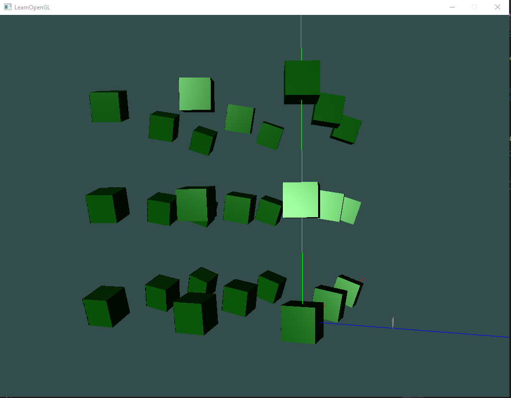
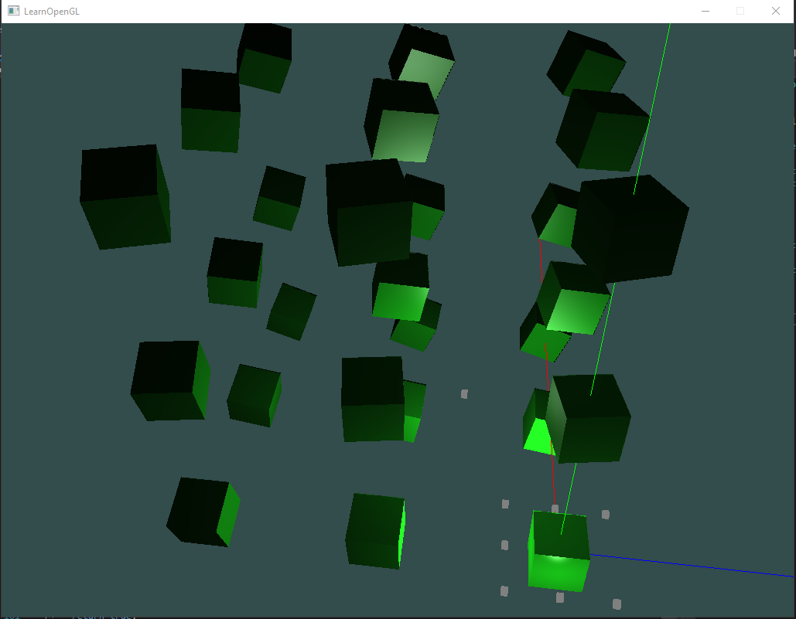
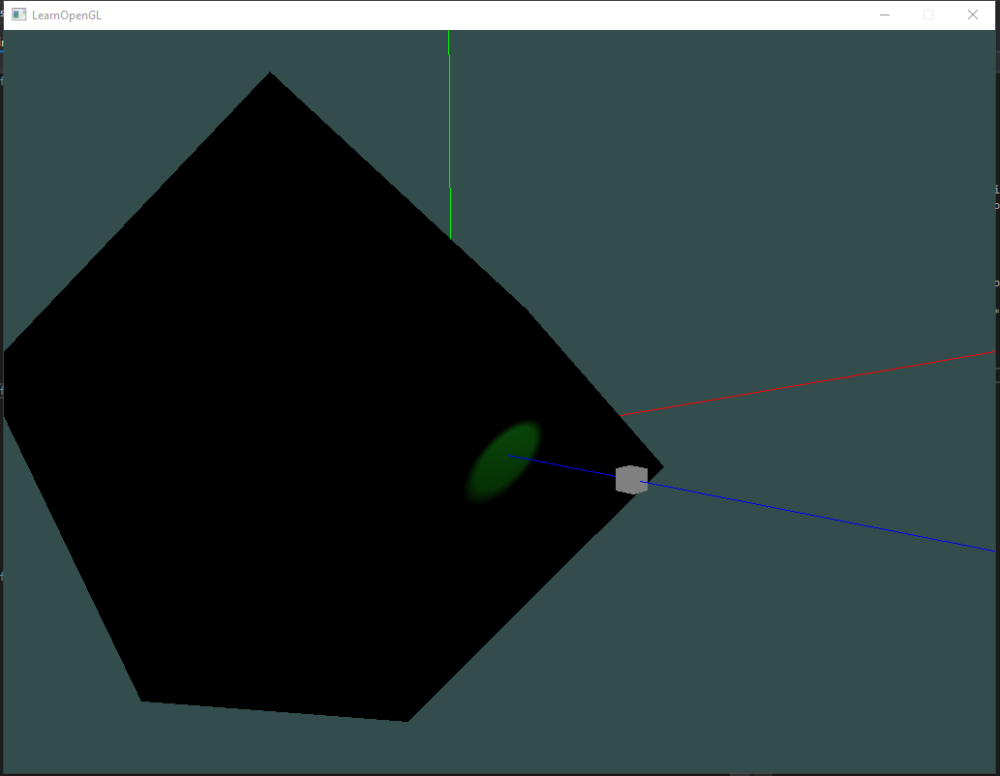
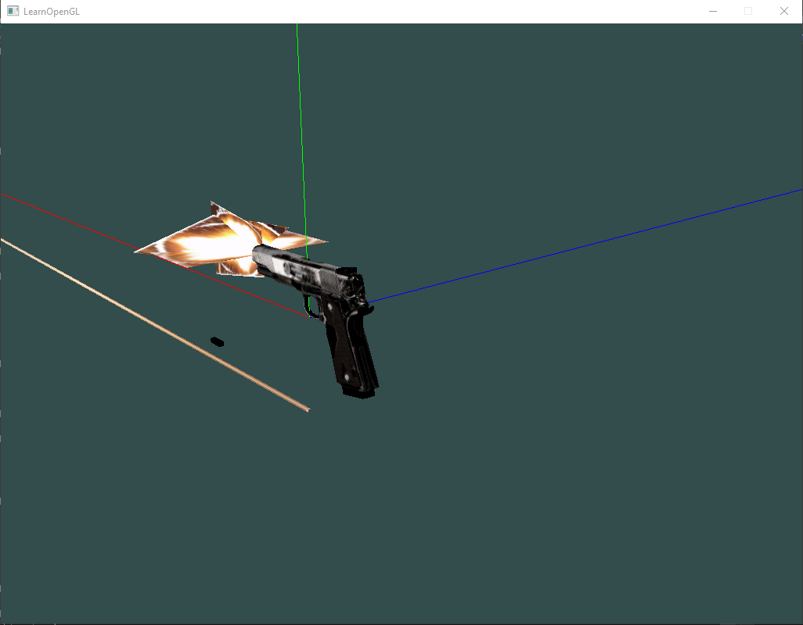

# OpenGL Sandbox
Simple project for try use OpenGL API functionality to take understanding about main work principles.

Using libraries:
1. For create window and interaction with gl context using glfw and glew libraries
2. For vector and matrix calculation using GLM library
3. For load textures using SOIL library
4. For load 3D models using assimp library

For easier way to create different render entity and make possibility to do some trivial tasks faster and comfortable in project were add next classes:
* Director - class which contains and give access to all main classes in project
* GLView - now contains only window pointer and window size
* GLRender - stub class, in future planning create render commands collecting logic in this class, and create real render procedure in it. Now each drawing node draw it content by it self in draw method
* ResourcesManager - class allow access to resource path throw this resource unique ID, relation (ID:path) write in separate json config
* AutoReleasePool - class for monitoring and deleting objects which was create with auto release functionality
* TimeScheduler - class allow organize work with time dependent callbecks
* InputController - class allow receive callbacks from input devices ( now mouse and keyboards )
* Scene - class is the main Node of scene graph. Director containing pointer to current render Scene. Scene contains camera and light sources ( direction, point light, flashlight ) objects

# Previews
Direction light

Point lights

Flashlight

3D model loading ( no lighting logic, dispayed only diffus textures )

